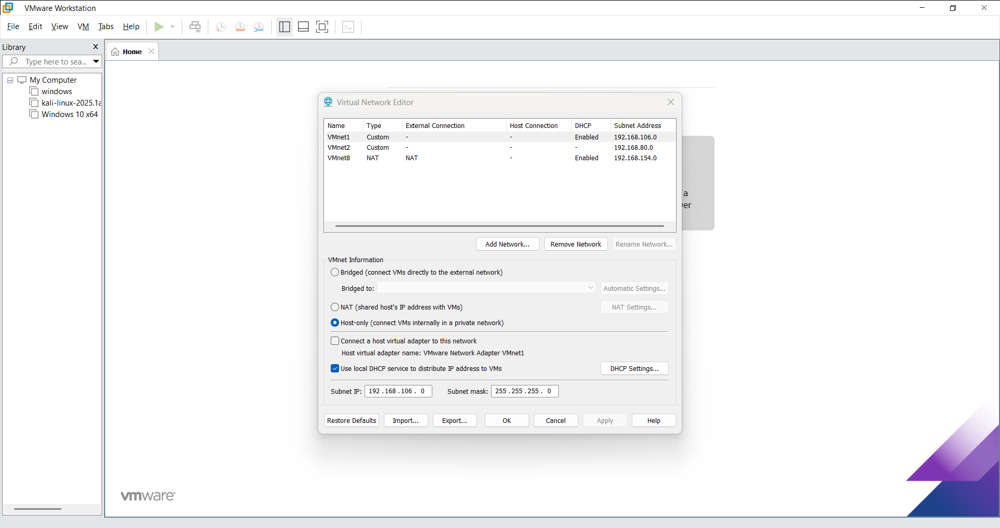
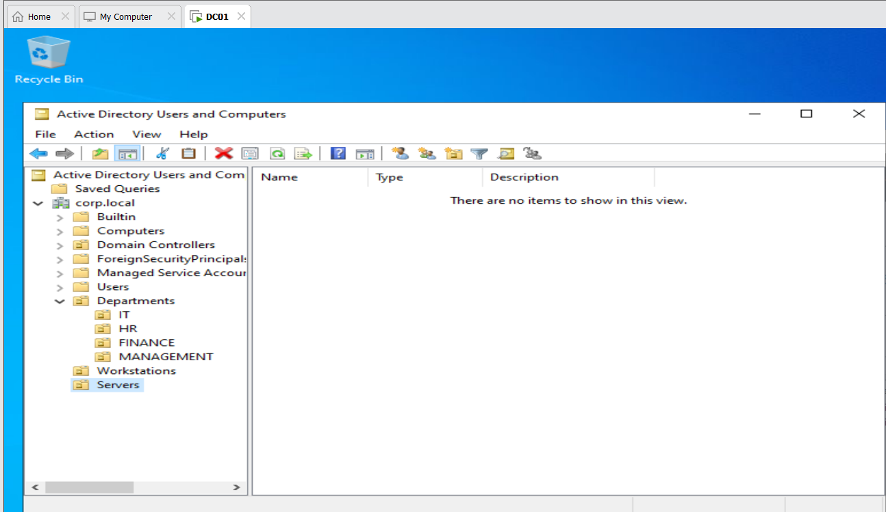
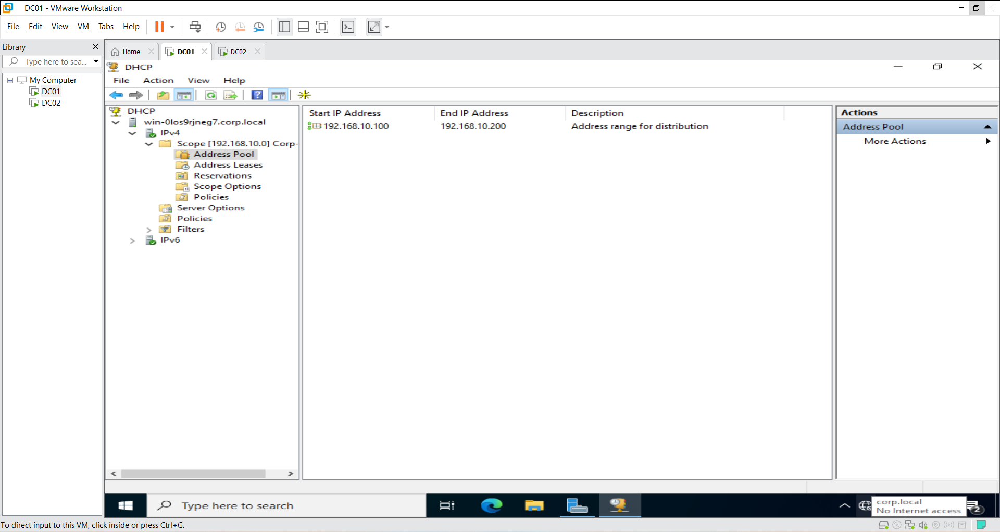
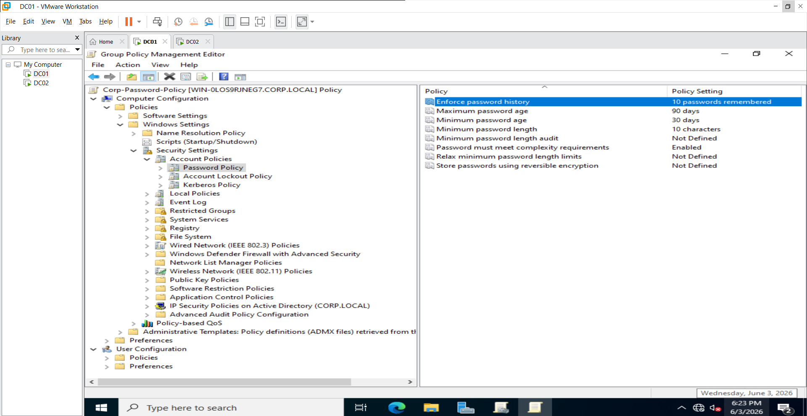

# 🖥️ Active Directory Home Lab

## Overview

Built a fully functional Windows Server 2022 

Active Directory domain from scratch using VMware 

Workstation. This lab simulates a real enterprise 

environment with dual domain controllers, DNS, DHCP, 

Group Policy, and a domain-joined Windows 10 client.

---

## 🗺️ Lab Topology

| Host       | Role                        | IP Address      |

|------------|-----------------------------|-----------------|

| DC01       | Primary DC, DNS, DHCP       | 192.168.10.10   |

| DC02       | Secondary DC, Replication   | 192.168.10.11   |

| CLIENT01   | Domain-joined Workstation   | DHCP (auto)     |

**Domain:** corp.local  

**Network:** 192.168.10.0/24  

**Hypervisor:** VMware Workstation  

**OS:** Windows Server 2022 + Windows 10 Enterprise

---

## 🛠️ What I Built

### 1. Active Directory Domain Services

- Deployed DC01 as primary domain controller

- Created corp.local forest and domain

- Built OU structure mirroring real enterprise layout

### 2. Secondary Domain Controller

- Deployed DC02 and joined to corp.local

- Configured AD replication between DC01 and DC02

- Verified replication using repadmin /replsummary

- Intentionally broke replication and restored it

&#x20; to practice troubleshooting

### 3. DNS

- Configured DC01 as primary DNS server

- DC02 points to DC01 for DNS resolution

- Verified name resolution across all VMs

### 4. DHCP

- Installed DHCP role on DC01

- Created scope: 192.168.10.100 - 192.168.10.200

- Reserved .1 to .99 for static server IPs

- CLIENT01 received IP automatically on boot

### 5. Organizational Units + Users

- Created OU structure:

&#x20; - Departments/IT

&#x20; - Departments/HR

&#x20; - Departments/Finance

&#x20; - Departments/Management

&#x20; - Workstations

&#x20; - Servers

- Created 4 domain user accounts

- Created IT-Staff security group

### 6. Group Policy (GPO)

- Corp-Password-Policy (domain-wide):

&#x20; - Minimum 10 character passwords

&#x20; - Complexity requirements enabled

&#x20; - 90 day expiry

&#x20; - 10 password history

- IT-Desktop-Policy (IT OU only):

&#x20; - Recycle Bin removed from desktop

&#x20; - Control Panel access blocked

### 7. Domain-Joined Client

- Installed Windows 10 Enterprise

- Joined CLIENT01 to corp.local

- Logged in as domain user (jsmith)

- Verified GPO applied correctly

---

## 🔧 Troubleshooting Performed

| Issue | Cause | Fix |

|-------|-------|-----|

| DC02 couldn't find domain | Wrong DNS (not pointing to DC01) | Set DNS to 192.168.10.10 |

| VMs couldn't communicate | Different VMware networks | Moved both to VMnet1 |

| Replication failing | Outbound replication disabled | repadmin /syncall /AdeP |

---

## 📸 Screenshots

### VMware Network Configuration

### Active Directory — OU Structure

### Users Created in OUs

### DHCP Scope Active

### GPO — Password Policy

### Replication Healthy

---

## 💡 Key Learnings

- How Active Directory replication works between DCs

- DNS is critical for domain functionality 

&#x20; most AD issues trace back to DNS

- GPOs apply hierarchically — domain level 

&#x20; affects everyone, OU level affects specific groups

- Static IPs are essential for servers, 

&#x20; DHCP for workstations

---

## 🧰 Technologies Used

- Windows Server 2022

- Active Directory Domain Services

- DNS Server

- DHCP Server

- Group Policy Management

- VMware Workstation

- repadmin (replication monitoring)

- Windows 10 Enterprise

---

## 📋 Skills Demonstrated

- Active Directory administration

- Domain Controller deployment and promotion

- DNS and DHCP configuration

- Group Policy creation and enforcement

- Replication monitoring and troubleshooting

- Network planning and documentation

\- Virtual lab environment setup

